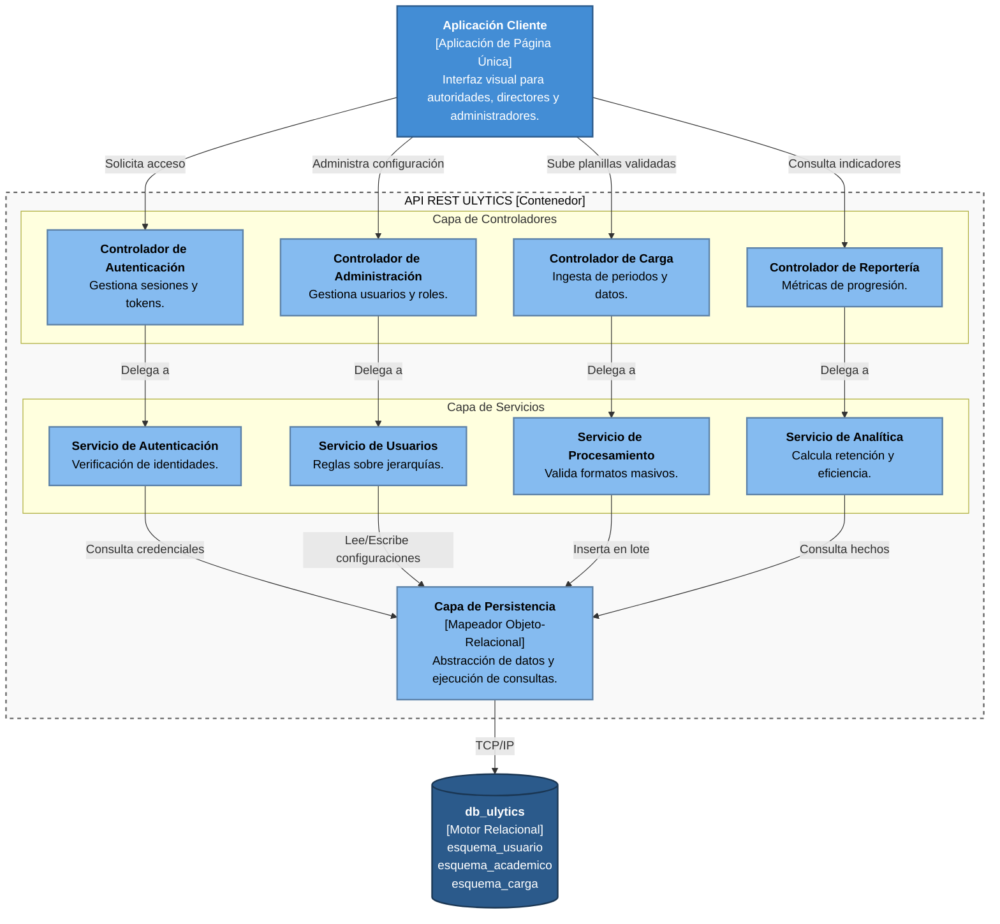

# Diagrama de componentes

```mermaid
%%{init: {'theme': 'base', 'themeVariables': {'background': '#ffffff', 'darkMode': }}}%%
flowchart TB
    classDef container fill:#438dd5,stroke:#2b5a8b,color:#ffffff,stroke-width:2px
    classDef component fill:#85bbf0,stroke:#5d82a8,color:#000000,stroke-width:2px
    classDef database fill:#2b5a8b,stroke:#1a3653,color:#ffffff,stroke-width:2px
    classDef boundary fill:#f9f9f9,stroke:#666666,stroke-width:2px,stroke-dasharray: 5 5,color:#000000

    spa["<b>Aplicación Cliente</b><br/>[Aplicación de Página Única]<br/>Interfaz visual para autoridades, directores y administradores."]:::container

    subgraph api ["API REST ULYTICS [Contenedor]"]
        direction TB
        
        subgraph controllers ["Capa de Controladores"]
            direction LR
            auth_c["<b>Controlador de Autenticación</b><br/>Gestiona sesiones y tokens."]:::component
            admin_c["<b>Controlador de Administración</b><br/>Gestiona usuarios y roles."]:::component
            carga_c["<b>Controlador de Carga</b><br/>Ingesta de periodos y datos."]:::component
            rep_c["<b>Controlador de Reportería</b><br/>Métricas de progresión."]:::component
        end

        subgraph services ["Capa de Servicios"]
            direction LR
            auth_s["<b>Servicio de Autenticación</b><br/>Verificación de identidades."]:::component
            user_s["<b>Servicio de Usuarios</b><br/>Reglas sobre jerarquías."]:::component
            carga_s["<b>Servicio de Procesamiento</b><br/>Valida formatos masivos."]:::component
            met_s["<b>Servicio de Analítica</b><br/>Calcula retención y eficiencia."]:::component
        end

        persist["<b>Capa de Persistencia</b><br/>[Mapeador Objeto-Relacional]<br/>Abstracción de datos y ejecución de consultas."]:::component

        %% Flujos Internos
        auth_c -->|"Delega a"| auth_s
        admin_c -->|"Delega a"| user_s
        carga_c -->|"Delega a"| carga_s
        rep_c -->|"Delega a"| met_s

        auth_s -->|"Consulta credenciales"| persist
        user_s -->|"Lee/Escribe configuraciones"| persist
        carga_s -->|"Inserta en lote"| persist
        met_s -->|"Consulta hechos"| persist
    end
    class api boundary

    db[("<b>db_ulytics</b><br/>[Motor Relacional]<br/>esquema_usuario<br/>esquema_academico<br/>esquema_carga")]:::database

    %% Relaciones Externas
    spa -->|"Solicita acceso"| auth_c
    spa -->|"Administra configuración"| admin_c
    spa -->|"Sube planillas validadas"| carga_c
    spa -->|"Consulta indicadores"| rep_c

    persist -->|"TCP/IP"| db
```